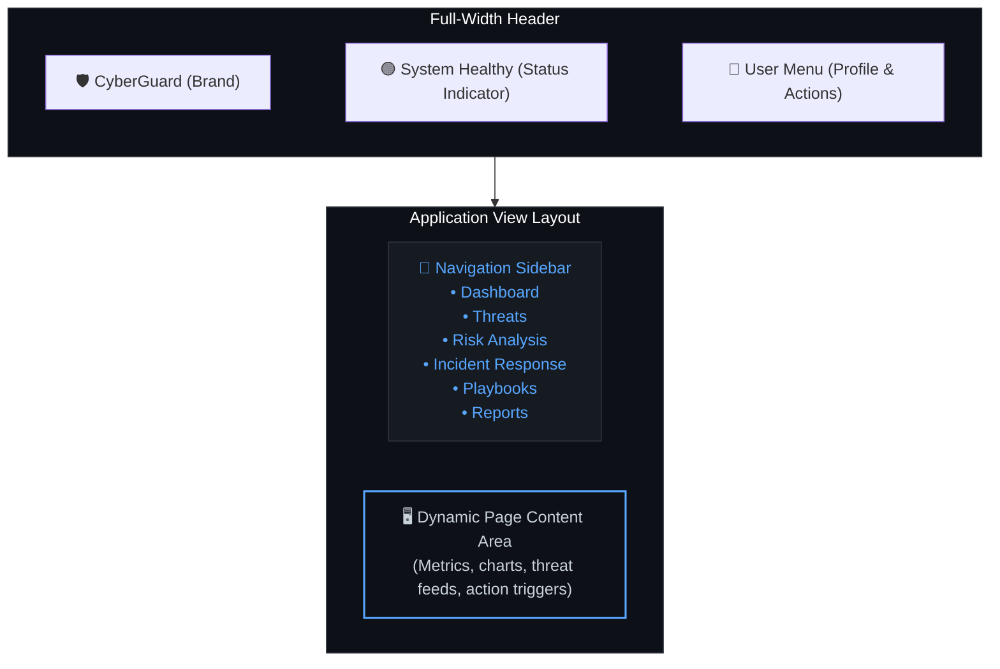

# CyberGuard — AI-Driven Threat Intelligence & Incident Response

An enterprise-grade, AI-powered cybersecurity platform built as a Final Year Project. CyberGuard unifies real-time threat monitoring, AI-assisted analysis, and automated incident response into a single, professional security operations interface.

[](https://nextjs.org/)
[](https://www.typescriptlang.org/)
[](https://supabase.com/)
[](https://tailwindcss.com/)
[](./LICENSE)

---

## Platform Status

| Area | Status | Details |
|---|---|---|
| **UI / Design System** | Complete | Unified electric cyan and neon green cyber theme across all pages |
| **Layout Architecture** | Complete | Full-width navbar + sidebar on all authenticated pages |
| **Landing Page** | Complete | Animated background effects, hero, features, footer |
| **Dashboard** | Complete | Real-time metrics, threat chart, incidents, AI analysis |
| **Authentication** | Complete | Supabase Auth — login, register, session, role-based access |
| **Admin Panel** | Complete | User management, system health, data sources, assets |
| **Settings / Profile** | Complete | Profile editing, role display, account details |
| **Database Integration** | Complete | Supabase Postgres — 7 tables, DB-first + mock fallback |
| **API Layer** | Complete | 8 endpoints with strict Zod validation, input sanitization, and sliding-window rate limiting |
| **Real-time / Client Events** | Complete | Custom Browser Events (`ai-analysis:completed`) — layout refreshes and live updates |
| **AI Pipeline** | Complete | 5-stage CrewAI pipeline via Groq LLM |

---

## Design System

CyberGuard uses a **unified dark cybersecurity aesthetic** established in `src/app/globals.css`:

- **Primary colour** — Electric Cyan (`#00e5ff`) used for all interactive elements, buttons, chart lines, and glowing accents
- **Accent colour** — Neon Green (`#00e676`) used for online indicators, healthy states, and active highlights
- **Background** — Deep navy-black (`hsl(224 71% 4%)`) for a clean ops feel
- **Typography** — Inter (Google Fonts)
- **Glassmorphism** — Sidebar and header use `backdrop-blur` where appropriate
- **Ambient effects** — Glowing cyan/neon green orb background rendered on the landing page only (`BackgroundEffects` component)

### Layout Structure (all authenticated pages)

```
┌──────────────────── Full-Width Header ────────────────────────┐
│   CyberGuard     [System Status]                       [User] │
├──────────┬────────────────────────────────────────────────────┤
│          │                                                     │
│ Sidebar  │              Page Content                          │
│  (nav)   │                                                     │
│          │                                                     │
└──────────┴────────────────────────────────────────────────────┘
```



---

## Features

### Landing Page
- **Premium Cybersecurity Aesthetic** — Structural blueprint grid-line overlays (`BackgroundEffects` component) with subtle cyan and green radial glow gradients.
- **Custom Mouse Cursor** — Lag-interpolated Cyan dot-and-ring follower cursor (`CustomCursor` component) with active resizing micro-animations on interactive hovers.
- **Hero & Live Threat Monitor** — Two-column split layout displaying professional bold headlines, interactive agent badges, CTA controls, and a live-scrolling animated threat monitor console backed by key SOC statistics.
- **Seamless Integrations Marquee** — Looping horizontal scroller track (`Marquee` component) highlighting continuous integrations (NVD, OTX, ThreatFox, MITRE ATT&CK...).
- **Before/After Incident Slider** — Interactive drag-slider (`TransformationSlider` component) showing the visual transformation between chaotic unmapped manual logs (200+ days breach gap) and automated multi-agent response (mitigated in 3s).
- **Workflow Pipeline & Specialists Grid** — Step-by-step security pipeline with large index row cards, and a designated team grid profile section showcasing the 5 specialized AI agents with online status tracking.

### Dashboard
- Real-time metrics (threats detected, risk score, active incidents, systems monitored)
- Cyber cyan area chart for threat activity with 24h / 7d / 30d time range picker
- Recent incidents list with severity badges
- **Run AI Analysis** — triggers 5-stage CrewAI pipeline with live progress panel

### Threats
- Full threat indicator table with severity filtering
- Source, confidence, and status tracking

### Risk Analysis
- Asset risk prioritization ranked by severity
- Vulnerability count and exposure time tracking
- Risk score breakdown with recommendations

### Incident Response
- Active incident list with detail panel
- Timeline view, assignee, status management
- Playbook integration

### Playbooks
- Pre-built response procedures by category (Malware, Ransomware, Phishing…)
- Full-text search
- Step-by-step execution guidance

### Reports
- Security, compliance, and threat report tracking
- Status tracking (Completed / In Progress)
- Statistics summary per report

### Admin Panel & RBAC
- User management (roles: admin, manager, analyst, viewer)
- Granular Role-Based Access Control (RBAC) restricting exports, deletions, and system configuration by role
- System health monitoring and audit logging
- Data source configuration with toggles
- Asset inventory

---

## Security Hardening

To align with OWASP best practices, CyberGuard implements robust API defense and verification mechanisms:

- **Sliding-Window Rate Limiting** (`src/lib/rate-limit.ts`) — In-memory request limiter tracking clients by authenticated User ID (preferred) or Client IP, returning RFC-compliant headers (`Retry-After`, `X-RateLimit-Limit`, `X-RateLimit-Remaining`, `X-RateLimit-Reset`).
- **Strict Schema Validation** (`src/lib/validation.ts`) — Centralized Zod validation layer covering all public and administrative route payloads. Enforces types, strict structures, limits, and rejects unknown fields via `.strict()`.
- **XSS Mitigation & Input Sanitization** — Automatically sanitizes and escapes HTML entities from incoming string variables before processing or storing them in Supabase.

---

## Tech Stack

| Layer | Technology |
|---|---|
| Framework | Next.js 16 (App Router) |
| Language | TypeScript 5 |
| Styling | Tailwind CSS 4.x + shadcn/ui |
| Charts | Recharts |
| Icons | Lucide React |
| Database | Supabase (Postgres) |
| Auth | Supabase Auth |
| Real-time | Custom Browser Events |
| AI / LLM | CrewAI + Groq (`llama-3.3-70b-versatile`) |
| Deployment | Vercel |

---

## Backend

CyberGuard's backend runs entirely within **Next.js API Routes**. It follows a **DB-first with mock fallback** pattern to ensure high availability and resilience.

> For implementation details, AI pipeline breakdown, and validation rules, see the [Backend Documentation](./docs/BACKEND.md).

---

## Database

The platform uses **Supabase** (managed PostgreSQL) with Row Level Security (RLS) to manage security-critical data.

> Detailed table schemas, user roles, and access control policies are documented in the [Database Documentation](./docs/DATABASE.md).

---

## Real-Time (Client Events)

Real-time page refreshes and layout updates are powered by **Custom Client-Side Browser Events (`ai-analysis:completed`)**, triggering instant visibility into newly generated threats, playbooks, and reports once the AI analysis completes.

> Event architecture, data refresh hooks, and usage examples are described in the [Client Events Documentation](./docs/WEBSOCKET.md).

---

## Project Structure

```
cyberguard-platform/
├── docs/
│   ├── ARCHITECTURE.md       System & component architecture
│   ├── SETUP.md              Installation & database setup
│   ├── API.md                Full API & WebSocket reference
│   └── CHANGELOG.md          Version history & change log
├── public/                   Static assets
├── src/
│   ├── app/
│   │   ├── layout.tsx        Root layout (ThemeProvider, AuthProvider)
│   │   ├── page.tsx          Landing page
│   │   ├── globals.css       Design system tokens (CSS variables)
│   │   ├── (dashboard)/      Dashboard route group
│   │   │   ├── layout.tsx    Full-width header + sidebar layout
│   │   │   ├── dashboard/
│   │   │   ├── threats/
│   │   │   ├── risk-analysis/
│   │   │   ├── incident-response/
│   │   │   ├── playbooks/
│   │   │   └── reports/
│   │   ├── settings/
│   │   │   ├── layout.tsx    Settings layout (same structure)
│   │   │   ├── page.tsx      Settings main page
│   │   │   └── profile/      Profile settings
│   │   ├── admin/
│   │   │   ├── layout.tsx    Admin layout (same structure)
│   │   │   ├── page.tsx      Admin panel
│   │   │   └── _tabs/        User, System, DataSources, Assets tabs
│   │   └── api/              Next.js API routes
│   │       ├── dashboard/
│   │       ├── threats/
│   │       ├── risk-analysis/
│   │       ├── incident-response/
│   │       ├── playbooks/
│   │       └── reports/
│   ├── components/
│   │   ├── layout/
│   │   │   ├── header.tsx              Full-width top navbar
│   │   │   ├── sidebar.tsx             Left navigation
│   │   │   ├── background-effects.tsx  Landing page grid blueprint overlay
│   │   │   └── custom-cursor.tsx       Mouse follow dot-and-ring follower
│   │   ├── dashboard/
│   │   ├── threats/
│   │   ├── risk-analysis/
│   │   ├── incident-response/
│   │   ├── playbooks/
│   │   ├── reports/
│   │   ├── landing/
│   │   │   ├── marquee.tsx             Looping integrations marquee
│   │   │   └── transformation-slider.tsx Draggable before/after comparison slider
│   │   ├── auth/
│   │   └── ui/                         shadcn/ui primitives
│   ├── lib/
│   │   ├── auth/             Auth context, types, helpers
│   │   ├── socket/           Socket.io client initializer
│   │   ├── supabase/         Client & server Supabase instances
│   │   └── agent-client.ts   AI pipeline health check
│   └── proxy.ts              Next.js route matcher (public routes)
└── README.md
```

---

## Quick Start

```bash
# 1. Clone & install
git clone https://github.com/YOUR_USERNAME/cyberguard-platform.git
cd cyberguard-platform
npm install

# 2. Set up environment variables
cp .env.example .env.local
# Add NEXT_PUBLIC_SUPABASE_URL, NEXT_PUBLIC_SUPABASE_ANON_KEY,
# SUPABASE_SERVICE_ROLE_KEY, GROQ_API_KEY

# 3. Run database migrations (SQL in docs/SETUP.md)

# 4. Start dev server
npm run dev
# → http://localhost:3000
```

> Full setup instructions: [docs/SETUP.md](./docs/SETUP.md)

---

## Documentation

| File | Contents |
|---|---|
| [docs/ARCHITECTURE.md](./docs/ARCHITECTURE.md) | System design, layout structure, component map |
| [docs/SETUP.md](./docs/SETUP.md) | Installation, env vars, DB setup, deployment |
| [docs/API.md](./docs/API.md) | REST endpoints + WebSocket events reference |
| [docs/CHANGELOG.md](./docs/CHANGELOG.md) | Full version history and change log |

---

## Important Notes

- **Educational purpose** — Built as a Final Year Project. Validate with security professionals before any production use.
- **Data privacy** — Uses Supabase Row Level Security (RLS). Keep your `SUPABASE_SERVICE_ROLE_KEY` secret.
- **AI pipeline** — Requires Groq API key. Without it, the Run AI Analysis button will return an error.

---

## Contributing

1. Fork the repository
2. Create a feature branch: `git checkout -b feature/your-feature`
3. Commit changes: `git commit -m 'feat: add your feature'`
4. Push: `git push origin feature/your-feature`
5. Open a Pull Request

---

<div align="center">

**Built with pride by the CyberGuard Team — Lahore University for Women University**

**Version:** 3.0.1 &nbsp;|&nbsp; **Status:** Active Development &nbsp;|&nbsp; **Last Updated:** June 2026

</div>
