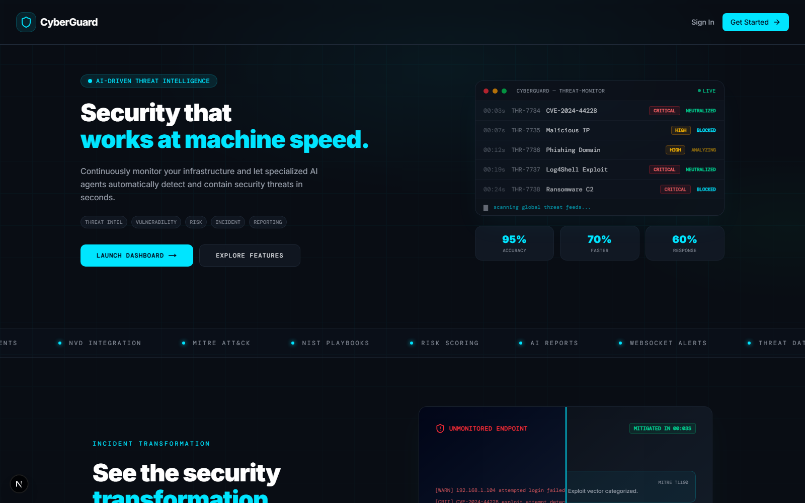
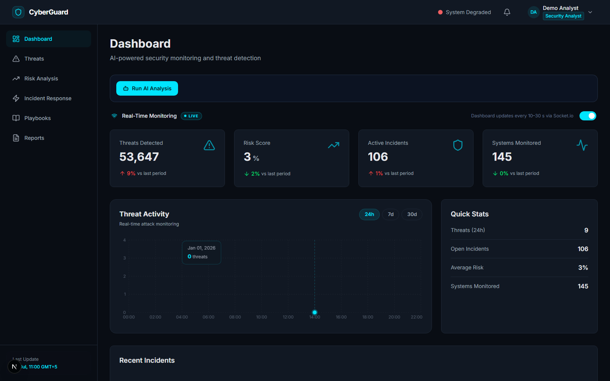
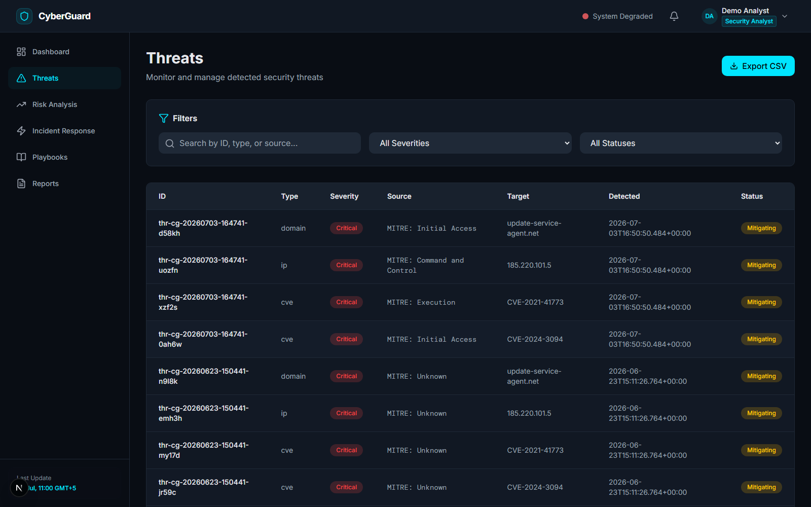

# CyberGuard — AI-Driven Threat Intelligence & Incident Response

An enterprise-grade, AI-powered cybersecurity platform built as a Final Year Project. CyberGuard unifies real-time threat monitoring, AI-assisted analysis, and automated incident response into a single, professional security operations interface.

[](https://nextjs.org/)
[](https://www.typescriptlang.org/)
[](https://supabase.com/)
[](https://upstash.com/)
[](https://socket.io/)
[](https://tailwindcss.com/)
[](./LICENSE)

---

## Screenshots

| Landing Page | Dashboard |
|---|---|
|  |  |

| Threat Intelligence |
|---|
|  |

---

## Platform Status

| Area | Status | Details |
|---|---|---|
| **UI / Design System** | Complete | Unified electric cyan and neon green cyber theme across all pages |
| **Layout Architecture** | Complete | Full-width navbar + sidebar on all authenticated pages |
| **Landing Page** | Complete | Animated background effects, hero, features, footer |
| **Dashboard** | Complete | Real-time metrics, threat chart, incidents, AI analysis |
| **Authentication** | Complete | Supabase Auth — login, register, session, role-based access |
| **Admin Panel** | Complete | User management, system health, data sources, assets |
| **Settings / Profile** | Complete | Profile editing, role display, account details |
| **Database Integration** | Complete | Supabase Postgres — 12 tables, all RLS-enabled, DB-first + mock fallback |
| **API Layer** | Complete | 18 endpoints with strict Zod validation, input sanitization, and sliding-window rate limiting |
| **Redis Integration** | Complete | Upstash Redis 7.2 — rate limiting, API caching, real-time metrics persistence |
| **Real-Time / Socket.io** | Complete | Socket.io 4.8 — live metrics every 30 s, chart data every 10 s, instant AI pipeline completion events |
| **Real-Time Toggle** | Complete | Per-user on/off switch, persisted across refreshes — pause live updates to focus on static snapshot during analysis |
| **Notifications** | Complete | Header bell with per-item read/unread state — live alerts on AI analysis completion and critical threats/incidents |
| **AI Pipeline** | Complete | 5-stage CrewAI pipeline via Anthropic Claude (Haiku 4.5), Redis-persisted job state, real per-task progress tracking, rate-limit-aware retry with backoff |
| **MITRE ATT&CK Coverage** | Complete | Full official Enterprise matrix (697 techniques) loaded from `.agents/data/mitre_attack_enterprise.json` |
| **Automated Testing** | Complete | 68 pytest tests (Python AI service) + 65 Vitest tests (Node/TS) — see [Testing](#testing) |
| **Evaluation** | Complete | Risk-scoring engine benchmarked against 8 known incidents (100% accuracy) + monotonicity checks — see [docs/EVALUATION.md](./docs/EVALUATION.md) |

---

## Features

### Landing Page
- **Premium Cybersecurity Aesthetic** — Structural blueprint grid-line overlays (`BackgroundEffects` component) with subtle cyan and green radial glow gradients.
- **Custom Mouse Cursor** — Lag-interpolated Cyan dot-and-ring follower cursor (`CustomCursor` component) with active resizing micro-animations on interactive hovers.
- **Hero & Live Threat Monitor** — Two-column split layout displaying professional bold headlines, interactive agent badges, CTA controls, and a live-scrolling animated threat monitor console backed by key SOC statistics.
- **Seamless Integrations Marquee** — Looping horizontal scroller track (`Marquee` component) highlighting continuous integrations (NVD, OTX, ThreatFox, MITRE ATT&CK...).
- **Before/After Incident Slider** — Interactive drag-slider (`TransformationSlider` component) showing the visual transformation between chaotic unmapped manual logs (200+ days breach gap) and automated multi-agent response (mitigated in 3s).
- **Workflow Pipeline & Specialists Grid** — Step-by-step security pipeline with large index row cards, and a designated team grid profile section showcasing the 5 specialized AI agents with online status tracking.

### Dashboard
- Real-time metrics (threats detected, risk score, active incidents, systems monitored) — pushed by Socket.io every 30 seconds
- Cyber cyan area chart for threat activity with live data points pushed every 10 seconds via Socket.io; 24h / 7d / 30d time range picker
- **Real-Time Monitoring Toggle** — pauses live updates for a static snapshot (see [Real-Time](#real-time-socketio--browser-events) for details)
- Recent incidents list with severity badges
- **Run AI Analysis** — triggers 5-stage CrewAI pipeline with live progress panel; dispatches `ai-analysis:completed` browser event on completion to refresh all pages

### Threats
- **Live Indicator Table** — every AI-run and manually logged threat (IP, domain, hash, CVE, URL) in one searchable, sortable table, with client-side search across ID, type, and source plus severity and status filter dropdowns.
- **Source, Confidence & Status Tracking** — each indicator carries its origin (MITRE mapping, OSINT feed, or manual entry), a confidence score, and a live status (e.g. mitigating, active) updated as the AI pipeline or an analyst acts on it.
- **CSV Export** — one-click export of the filtered threat list for offline analysis or evidence collection.

### Risk Analysis
- **Asset Risk Prioritization** — assets ranked by computed risk score (0–100), with critical/high/medium/low distribution charts summarizing exposure across the whole inventory.
- **Vulnerability & Exposure Tracking** — per-asset vulnerability counts and exposure-time indicators surface which systems have been sitting unpatched the longest.
- **Recommendation Engine** — each risk entry ships with a human-readable remediation recommendation generated by the AI pipeline (falling back to a rule-based suggestion keyed off risk level when the pipeline hasn't run), with raw scoring formulas auto-detected and rendered separately from plain-language advice.
- **CSV Export** — download the full risk register for reporting or offline review.

### Incident Response
- **Active Incident List + Detail Panel** — click into any incident for full context: affected assets, MITRE ATT&CK technique mapping, and the AI-generated response playbook tied to it.
- **Timeline, Assignee & Status Management** — a chronological timeline of incident activity, plus assignee and status controls (Open → Contained → Resolved) — visible and editable only for roles with `canAssignIncidents` (Manager/Admin), enforced both in the UI and on the server.
- **Playbook Integration** — jump straight from an incident to its linked step-by-step containment/eradication/recovery playbook.
- **CSV Export** — gated behind `canExportData`, for exporting the incident log.

### Playbooks
- **Pre-Built & AI-Generated Procedures** — organized by category (Malware, Ransomware, Phishing, and more), spanning both manually authored playbooks and ones generated per-incident by the AI pipeline.
- **Category Filtering** — filter the grid by category; the underlying API also supports full-text `search` and pagination for future UI expansion.
- **Step-by-Step Execution Guidance** — each playbook breaks down into preparation, identification, containment, eradication, recovery, and post-incident sections, with per-step reasoning and copy-ready commands where applicable.
- **Manual Playbook Creation** — analysts can author their own playbooks via a guided creation modal in addition to the AI-generated ones.

### Reports
- **Security, Compliance & Threat Report Tracking** — every AI pipeline run generates an executive summary, a technical report, and a compliance report in a single pass, alongside manually created reports.
- **Status Tracking** — reports move through Completed / In Progress status as they're generated or reviewed.
- **One-Page Summary View** — the detail panel condenses each report into posture score, top risk, business impact, key findings, and prioritized recommendations at a glance, with full technical/compliance depth reserved for the PDF export.
- **PDF Export** — gated behind `canExportData`, exports the full multi-section report (not just the one-page summary) as a formatted PDF.

### Admin Panel & RBAC
- **User Management** — four roles (admin, manager, analyst, viewer), each with a distinct permission set; admins can change roles, deactivate, or permanently delete accounts (self-deletion blocked).
- **Granular Role-Based Access Control (RBAC)** — a single server-side permission guard (`requirePermission`) enforces capabilities like `canDeleteData`, `canAssignIncidents`, `canExportData`, and `canRunAiAnalysis` on every relevant API route, not just in the UI — so hiding a button never substitutes for actually checking permissions.
- **System Health Monitoring & Audit Logging** — live health status for the AI agent service and Redis, plus an append-only audit log of authentication events, data access, and configuration changes.
- **Data Source Configuration** — toggle individual threat intelligence feeds (NVD, OTX, ThreatFox, URLhaus, AbuseIPDB) on or off.
- **Asset Inventory** — full CRUD on organizational assets, restricted to admins at the API level, feeding the risk correlation engine.

---

## Security Hardening

To align with OWASP best practices, CyberGuard implements robust API defense and verification mechanisms:

- **Redis-Backed Sliding-Window Rate Limiting** (`src/lib/rate-limit.ts`) — Distributed rate limiter using **Upstash Redis sorted sets** (`ZADD` / `ZREMRANGEBYSCORE` / `ZCARD` pipeline). Tracks clients by authenticated User ID (preferred) or Client IP. Returns RFC-compliant headers (`Retry-After`, `X-RateLimit-Limit`, `X-RateLimit-Remaining`, `X-RateLimit-Reset`). Persists across server restarts and works correctly across multiple instances. Gracefully falls back to an in-memory store if Redis is unavailable.
- **Redis API Response Caching** (`src/lib/cache.ts`) — Generic cache layer wrapping dashboard API routes. Dashboard metrics are cached for **30 seconds** and chart data for **60 seconds** (keyed per `timeRange`). Cache entries are namespaced under `cg:cache:*` and auto-expire via Redis TTL. Returns `X-Cache: HIT / MISS` headers for transparent debugging.
- **Real-Time Metrics Persistence** (`server.js`) — Live dashboard metrics (threat count, risk score, active incidents) are stored in Redis under `realtime:metrics` with a 24-hour TTL, so simulated values survive server restarts.
- **Strict Schema Validation** (`src/lib/validation.ts`) — Centralized Zod validation layer covering all public and administrative route payloads. Enforces types, strict structures, limits, and rejects unknown fields via `.strict()`.
- **XSS Mitigation & Input Sanitization** — Automatically sanitizes and escapes HTML entities from incoming string variables before processing or storing them in Supabase.
- **Generalized RBAC Guard** (`requirePermission()` in `src/lib/auth/require-delete-permission.ts`) — a single server-side permission check reused across routes (e.g. `canDeleteData` on report/incident/playbook deletes, `canAssignIncidents` on incident reassignment), so authorization can never be enforced in the UI alone.
- **Service-to-Service Auth** — the Next.js backend and the Python AI microservice authenticate each other via a shared `AGENT_API_SECRET` (`x-api-key` header); the custom server's internal Socket.io bridge (`POST /api/internal/socket-emit`) requires a matching `INTERNAL_WEBHOOK_SECRET`. Both replace an earlier implicit trust-by-network-position model.
- **Locked-Down CORS** — Socket.io (both `server.js` and the FastAPI service) now allow only the configured `NEXT_PUBLIC_APP_URL` origin, replacing a wildcard `origin: '*'`.
- **Opaque Content at Rest** (`src/lib/opaque-content.ts`) — AI-generated report/playbook content is base64-wrapped before being written to Supabase, so freeform LLM text describing exploits/commands/IOCs can't be misread by an upstream WAF as an attack payload; reads decode transparently.
- **Encryption at Rest** (`src/lib/crypto.ts`) — third-party data-source API keys (NVD, OTX, etc.) are AES-256-GCM encrypted before being written to Supabase, never stored in plaintext.
- **Row Level Security** — RLS is enabled on every application table; the service-role client used by API routes bypasses it as intended, but it default-denies the public anon key from ever reading/writing these tables directly against Supabase's REST API.
- **Bot Protection** (`src/components/auth/turnstile-widget.tsx`, `src/lib/turnstile.ts`) — Cloudflare Turnstile gates login and signup, verified server-side before either action runs.
- **Login Rate Limiting** — `login()` throttles by both IP and the attempted email address, independent of the general API rate limiter.
- **Delete Confirmation** (`src/components/ui/delete-confirm-dialog.tsx`) — every destructive action (reports, incidents, playbooks, notifications) requires an explicit confirm, not just a permission check.

---

## Tech Stack

| Layer | Technology |
|---|---|
| Framework | Next.js 16 (App Router) |
| Language | TypeScript 5 |
| Styling | Tailwind CSS 4.x + shadcn/ui |
| Charts | Recharts |
| Icons | Lucide React |
| Database | Supabase (Postgres) |
| Auth | Supabase Auth |
| Cache / Rate Limiting | Upstash Redis 7.2 (REST API) |
| Real-time | Socket.io 4.8 (WebSocket) + Custom Browser Events (`ai-analysis:completed`) |
| AI / LLM | CrewAI + Anthropic Claude (`claude-haiku-4-5-20251001`) |
| Deployment | Railway — two services: the Next.js app (`railway.json`, Nixpacks) and the Python AI microservice (`.agents/railway.json`, Dockerfile). Vercel is not used: the custom Socket.io server (`server.js`) needs a long-running process, which Vercel's serverless model doesn't support. |

---

## Backend

CyberGuard's backend runs entirely within **Next.js API Routes**. It follows a **DB-first with mock fallback** pattern to ensure high availability and resilience.

> For implementation details, AI pipeline breakdown, and validation rules, see the [Backend Documentation](./docs/BACKEND.md).

---

## Database

The platform uses **Supabase** (managed PostgreSQL) with Row Level Security (RLS) to manage security-critical data.

> Detailed table schemas, user roles, and access control policies are documented in the [Database Documentation](./docs/DATABASE.md).

---

## Real-Time (Socket.io + Browser Events)

Live dashboard updates are powered by a **dual real-time system**:

1. **Socket.io** (`server.js` + `src/lib/socket/`) — persistent WebSocket connection on `/api/socket`. Server broadcasts `metrics:update` every 30 s and `chart:update` every 10 s to all connected clients. The `RunAnalysisButton` also triggers socket events via an internal webhook (`POST /api/internal/socket-emit`) when the AI pipeline completes.

2. **Custom Browser Events** (`ai-analysis:completed`) — dispatched by `RunAnalysisButton` on pipeline completion. Hooks (`usePageRefresh`) respond by calling `router.refresh()` to re-run Server Components and pull fresh data from Supabase across all dashboard pages.

3. **Real-Time Monitoring Toggle** (`RealtimeToggle` component) — lets any authenticated user (admin, manager, analyst) pause Socket.io-driven updates. When **paused**, the dashboard freezes at the last snapshot so users can analyse the AI pipeline output without live numbers changing.

> Event architecture, data refresh hooks, and usage examples are described in the [Client Events Documentation](./docs/WEBSOCKET.md).

---

## Project Structure

```
cyberguard-platform/
├── docs/
│   ├── architecture.md       System & component architecture
│   ├── SETUP.md              Installation & database setup
│   ├── API.md                Full API & WebSocket reference
│   └── CHANGELOG.md          Version history & change log
├── public/                   Static assets
├── src/
│   ├── app/
│   │   ├── layout.tsx        Root layout (ThemeProvider, AuthProvider)
│   │   ├── page.tsx          Landing page
│   │   ├── globals.css       Design system tokens (CSS variables)
│   │   ├── (dashboard)/      Dashboard route group
│   │   │   ├── layout.tsx    Full-width header + sidebar layout
│   │   │   ├── dashboard/
│   │   │   ├── threats/
│   │   │   ├── risk-analysis/
│   │   │   ├── incident-response/
│   │   │   ├── playbooks/
│   │   │   └── reports/
│   │   ├── settings/
│   │   │   ├── layout.tsx    Settings layout (same structure)
│   │   │   ├── page.tsx      Settings main page
│   │   │   └── profile/      Profile settings
│   │   ├── admin/
│   │   │   ├── layout.tsx    Admin layout (same structure)
│   │   │   ├── page.tsx      Admin panel
│   │   │   └── _tabs/        User, System, DataSources, Assets tabs
│   │   └── api/              Next.js API routes
│   │       ├── dashboard/
│   │       ├── threats/
│   │       ├── risk-analysis/
│   │       ├── incident-response/
│   │       ├── playbooks/
│   │       └── reports/
│   ├── components/
│   │   ├── layout/
│   │   │   ├── header.tsx              Full-width top navbar
│   │   │   ├── sidebar.tsx             Left navigation (socket-aware last-update)
│   │   │   ├── background-effects.tsx  Landing page grid blueprint overlay
│   │   │   └── custom-cursor.tsx       Mouse follow dot-and-ring follower
│   │   ├── dashboard/
│   │   │   ├── run-analysis-button.tsx AI pipeline trigger + progress panel
│   │   │   ├── realtime-toggle.tsx     Live / Paused Socket.io toggle
│   │   │   ├── metrics-grid.tsx        4 live metric cards
│   │   │   ├── quick-stats.tsx         Summary stats panel
│   │   │   └── recent-incidents.tsx    Latest incidents list
│   │   ├── threats/
│   │   ├── risk-analysis/
│   │   ├── incident-response/
│   │   ├── playbooks/
│   │   ├── reports/
│   │   ├── landing/
│   │   │   ├── marquee.tsx             Looping integrations marquee
│   │   │   └── transformation-slider.tsx Draggable before/after comparison slider
│   │   ├── auth/
│   │   └── ui/                         shadcn/ui primitives
│   ├── hooks/
│   │   ├── use-socket-events.ts        useSocketMetrics, useSocketChartData, useSocketIncidents
│   │   ├── use-page-refresh.ts         ai-analysis:completed browser event listener
│   │   └── use-fetch-data.ts           Generic API fetch hook
│   ├── lib/
│   │   ├── auth/             Auth context, types, helpers
│   │   ├── socket/
│   │   │   ├── socket.ts              Socket.io client singleton (initSocket, event helpers)
│   │   │   ├── socket-server.ts       Socket.io server initializer
│   │   │   └── mock-data-generator.ts Data generators for simulated broadcasts
│   │   ├── supabase/         Client & server Supabase instances
│   │   ├── redis.ts          Upstash Redis singleton client
│   │   ├── cache.ts          Generic Redis cache helpers (get/set/del/invalidate)
│   │   ├── rate-limit.ts     Redis sliding-window rate limiter
│   │   └── agent-client.ts   AI pipeline health check
│   └── proxy.ts              Next.js route matcher (public routes)
├── server.js                 Custom Node.js server (Socket.io + Redis metrics)
└── README.md
```

---

## Quick Start

```bash
# 1. Clone & install
git clone https://github.com/NareenAsad/cyberguard-platform.git
cd cyberguard-platform
pnpm install

# 2. Set up environment variables
# Create .env.local and add the following:
```

```env
# Supabase
NEXT_PUBLIC_SUPABASE_URL=your_supabase_project_url
NEXT_PUBLIC_SUPABASE_ANON_KEY=your_supabase_anon_key
SUPABASE_SERVICE_ROLE_KEY=your_supabase_service_role_key

# AI
ANTHROPIC_API_KEY=your_anthropic_api_key

# Shared secrets — must match between the Next.js app and the Python AI
# microservice (AGENT_API_SECRET) / server.js's internal socket bridge
# (INTERNAL_WEBHOOK_SECRET)
AGENT_API_SECRET=your_generated_secret
INTERNAL_WEBHOOK_SECRET=your_generated_secret

# Cloudflare Turnstile — bot protection on login/signup (dash.cloudflare.com)
NEXT_PUBLIC_TURNSTILE_SITE_KEY=your_turnstile_site_key
TURNSTILE_SECRET_KEY=your_turnstile_secret_key

# Upstash Redis (Redis 7.2) — get from https://console.upstash.com
# Required for rate limiting, API caching, and metrics persistence
UPSTASH_REDIS_REST_URL=https://your-db.upstash.io
UPSTASH_REDIS_REST_TOKEN=your_upstash_token
```

```bash
# 3. Run database migrations (SQL in docs/SETUP.md)

# 4. Start dev server (runs custom Node.js server with Socket.io)
pnpm run dev
# → http://localhost:3000
# → Socket.io ready on ws://localhost:3000/api/socket
```

> **Redis setup:** Create a free database at [console.upstash.com](https://console.upstash.com) → copy the REST URL and token. Without Redis credentials the app runs normally using in-memory fallbacks.

> Full setup instructions: [docs/SETUP.md](./docs/SETUP.md)

---

## Documentation

| File | Contents |
|---|---|
| [docs/architecture.md](./docs/architecture.md) | System design, layout structure, component map |
| [docs/SETUP.md](./docs/SETUP.md) | Installation, env vars, DB setup, deployment |
| [docs/API.md](./docs/API.md) | REST endpoints + WebSocket events reference |
| [docs/WEBSOCKET.md](./docs/WEBSOCKET.md) | Real-time architecture — Socket.io + browser events |
| [docs/BACKEND.md](./docs/BACKEND.md) | Backend patterns, rate limiting, Redis, AI pipeline |
| [docs/EVALUATION.md](./docs/EVALUATION.md) | Risk-scoring engine benchmark & monotonicity results |
| [docs/CHANGELOG.md](./docs/CHANGELOG.md) | Full version history and change log |

---

## Testing

**Node / TypeScript** (Vitest — validation schemas, risk-scoring engine, known-incident benchmark):

```bash
pnpm test          # run once
pnpm test:watch    # watch mode
```

**Python AI service** (pytest — risk engine, LLM JSON-extraction robustness,
CrewAI tools with mocked external APIs, Redis job store, evaluation benchmark):

```bash
cd .agents
venv\Scripts\python.exe -m pytest      # Windows
# or: source venv/bin/activate && pytest
```

Both suites run fully offline — external HTTP calls (NVD, OTX, Redis) are
mocked, so no API keys are required to run them.

---

## Important Notes

- **Educational purpose** — Built as a Final Year Project. Validate with security professionals before any production use.
- **Data privacy** — Uses Supabase Row Level Security (RLS). Keep your `SUPABASE_SERVICE_ROLE_KEY` secret.
- **AI pipeline** — Requires an Anthropic API key (Claude), plus a matching `AGENT_API_SECRET` on both the Next.js app and the Python AI microservice. Without them, the Run AI Analysis button will return an error.
- **Real-time** — Socket.io runs via a custom Node.js server (`server.js`). Standard `next start` does not include Socket.io; always start with `pnpm run dev` or `node server.js`.

---

## Team

| Name | GitHub | Role |
|---|---|---|
| Nareen Asad | [@NareenAsad](https://github.com/NareenAsad) | Project Lead & Full-Stack Development |
| Anber Aziz | [@AnberAziz](https://github.com/AnberAziz) | Frontend Development |
| Sunbal Aziz | [@SunbalAzizLCWU](https://github.com/SunbalAzizLCWU) | AI Integration |
| Minahil Irfan | [@MinahilIrfan98](https://github.com/MinahilIrfan98) | UI/UX Design |

---

## Contributing

This is a university Final Year Project maintained by the team below. If you'd like to propose a change:

1. Create a feature branch: `git checkout -b feature/your-feature`
2. Commit changes: `git commit -m 'feat: add your feature'`
3. Push and open a Pull Request against `main`

---

<div align="center">

**Built with pride by the CyberGuard Team — Lahore College for Women University**

**Version:** 3.7.0 &nbsp;|&nbsp; **Status:** Active Development &nbsp;|&nbsp; **Last Updated:** August 2026

</div>
